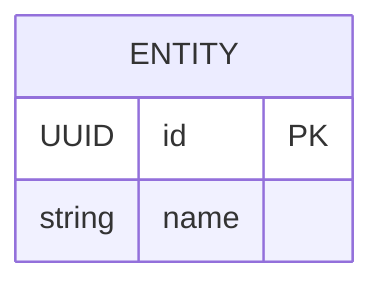
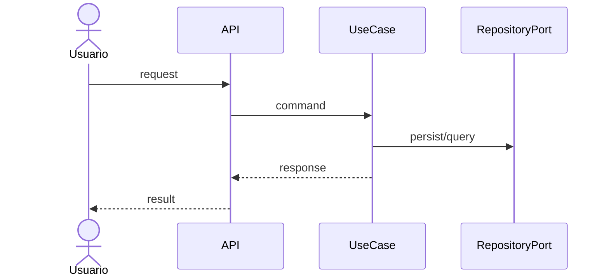
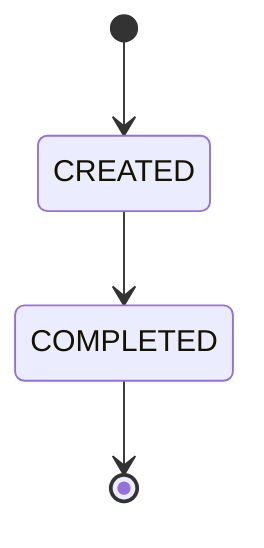

# Feature Details - {feature_name}

Referencia componente: `{component_architecture_link}`

## Historia de usuario

```gherkin
Feature: {feature_name}

  Scenario: {happy_path}
    Given {initial_state}
    When {action}
    Then {expected_result}
```

## Modelo entidad relacion



## Diagrama de secuencia



## Contratos de integracion

### APIs expuestas

```yaml
openapi: 3.1.0
paths: {}
```

### Eventos consumidos

```yaml
event_consumers:
  - id: EC-001
    topic: {context.entity.event.v1}
    owner: {producer_team}
```

### Eventos publicados

```yaml
event_publishers:
  - id: EP-001
    topic: {context.entity.event.v1}
    owner: {owning_team}
```

## Reglas de negocio

```yaml
business_rules:
  - id: BR-001
    description: "{business_rule}"
```

## Maquina de estados



## Casos de prueba

```yaml
unit_tests:
  - id: UT-001
    name: {test_name}
    expected_result: {expected_result}

integration_tests:
  - id: IT-001
    name: {test_name}
    expected_result: {expected_result}
```

## Trazabilidad

| Requisito | Contrato | Test | Task |
|---|---|---|---|
| FR-001 | {contract} | UT-001 | T001 |

