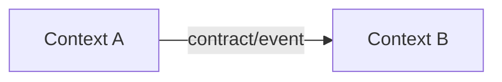

# Strategy Architecture - {initiative_name}

## Introduccion

Describir la necesidad de negocio, dominio origen, dominios impactados y objetivo de la iniciativa.

## Catalogo semantico

Referenciar catalogos canonicos:

- `catalogs/semantic-catalog.yml`
- Catalogo de dominio de la wiki F2X aplicable.

Agregar solo terminos nuevos o especificos de la iniciativa.

## Objetivo

Definir que resultado de negocio habilita la iniciativa y que queda fuera del alcance.

## Drivers de arquitectura

### Requerimientos arquitectonicamente significativos

| ID | Requerimiento | Impacto |
|---|---|---|
| ASR-001 | {requirement} | {impact} |

### Atributos de calidad

```yaml
quality_attributes:
  - id: QA-001
    name: {quality_attribute}
    priority: critical
    scenario:
      source: {source}
      stimulus: {stimulus}
      environment: {environment}
      artifact: {artifact}
      expected_response: {response}
      metric: {metric}
```

### Restricciones tecnicas

- {technical_constraint}

### Prohibiciones de diseno

- {prohibited_design}

### Principios de diseno

- {design_principle}

## Modelo de dominio

| Dominio/Contexto | Responsabilidad | Owner |
|---|---|---|
| {context} | {responsibility} | {owner} |

## Context mapping



## Funcionalidades arquitectonicamente significativas

### {feature_name}

#### Vista de contexto

```mermaid
C4Context
    title Context - {feature_name}
```

#### Vista de contenedores

```mermaid
C4Container
    title Containers - {system_name}
```

## Dependencias entre equipos

| Equipo cliente | Equipo proveedor | Solicitud | Contrato | Estado |
|---|---|---|---|---|
| {client_team} | {provider_team} | {request} | {contract} | {status} |

## Decisiones

| ADR | Decision | Estado |
|---|---|---|
| ADR-001 | {decision} | proposed |

## Validacion

- Gate C0 completado.
- Gate C1 completado.
- Gate C3 requerido antes de tasking.

