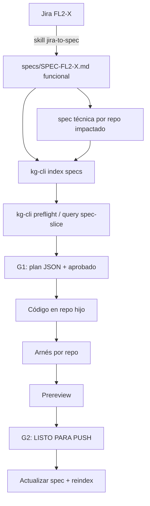

# README — combustibles (spec-first)

Índice de specs del dominio **Combustibles** en `workspace_fuel`. La fuente de verdad funcional vive aquí; el detalle técnico vive en `specs/` de cada repo hijo.

## Identificación

| Campo | Valor |
|-------|--------|
| Épico Jira | [FL2-25105](https://flypass.atlassian.net/browse/FL2-25105) |
| Dominio | `combustibles` |
| Workspace | `/home/jerso/workspace_fuel` |
| Contrato fuel | [_api-fuel-policy.md](_api-fuel-policy.md) |
| Contrato conductores | [_api-drivers.md](_api-drivers.md) |
| Estado | 🟢 Spec-first activo — specs técnicas existentes indexables |

## Modelo de dos niveles

| Nivel | Dónde | Qué contiene | Plantilla |
|-------|-------|--------------|-----------|
| **Funcional** (`type: functional`) | `specs/SPEC-FL2-*.md` (este workspace) | Qué + criterios de aceptación + repos impactados | `_templates/SPEC-FL2-XXXXX.template.md` |
| **Técnica** (`type: technical`) | `<repo>/specs/000X_SPEC_*.md` | Cómo, por repo; enlaza a la funcional vía `refines:` | `_templates/spec-tecnica.template.md` |
| **Contexto** (`type: context`) | `<repo>/specs/0000_SPEC_project_context.md` y `specs/0000_SPEC_contexto_dominio_combustibles.md` (workspace) | Contexto base del repo / dominio; siempre se lee primero | patrón FPE |

Toda spec lleva **front-matter YAML** (id, type, status, repo/repos, refines, depends_on, flows, entities, endpoints, figma). El front-matter es lo que indexa `kg-cli`.

## Flujos de negocio

Los **3 flujos de combustibles** están definidos canónicamente en `specs/0000_SPEC_contexto_dominio_combustibles.md` (`CTX-COMBUSTIBLES`, front-matter `flow_definitions`) y son consultables desde el grafo con `./tools/kg-cli query flows`:

| Key | Flujo | Inicia | Relación con conductores |
|-----|-------|--------|--------------------------|
| `b2c-supply-completed` | B2C — suministro ya completado | QR de la app (`SUPPLY_COMPLETED`) | No aplica (autenticación `JWT_APP`) |
| `b2c-supply-in-progress` | B2C — suministro en proceso | QR de la app (`SUPPLY_ON_PROGRESS`) | No aplica (autenticación `JWT_APP`) |
| `b2b` | B2B — política por placa | POS del proveedor | **La política está asociada a una placa, y la placa a un conductor** (`PUSH_TOTP` al conductor; repo `backend-customer-account-drivers`) |

Cada spec de trabajo declara `flows:` en su front-matter; `[]` = transversal a todos los flujos de infraestructura.

## Repos del workspace

| Capa | Repo | Prefijo spec técnica | specs/ |
|------|------|---------------------|--------|
| Frontend (Nx MFE) | `frontend-micro-fuel` | `MFE-` | `frontend-micro-fuel/specs/` |
| Backend combustibles | `backend-product-fuel-policy-enforcer` | `FPE-` | `backend-product-fuel-policy-enforcer/specs/` |
| Backend conductores | `backend-customer-account-drivers` | `CAD-` | `backend-customer-account-drivers/specs/` |

## Reglas globales (todas las specs)

- Trazabilidad: cada spec funcional enlaza su ticket Jira en `jira:` del front-matter.
- Una spec por sesión de agente; plan macro del flujo aparte.
- UI web: convenciones del repo frontend + MCP Figma (node-id obligatorio en `figma:`).
- Contratos: mantener `specs/_api-*.md` alineados con OpenAPI/backend.
- Cross-repo: el plan JSON debe listar `files_to_touch[]` y `harness_commands[]` por repo.
- **Specs vivas**: todo cambio sustantivo de comportamiento actualiza la spec y reindexa (`kg-cli index specs`). Si spec y código divergen, preguntar antes de codificar.

## Ciclo spec-first



## Índice de specs del workspace

| Orden | ID | Archivo | Título | Flujo(s) | Bloqueado por | Estado |
|-------|-----|---------|--------|----------|---------------|--------|
| — | CTX-COMBUSTIBLES | `0000_SPEC_contexto_dominio_combustibles.md` | Contexto de dominio — flujos B2C/B2B y relación con conductores | define los 3 | — | contexto |
| 1 | SPEC-FL2-24307 | `SPEC-FL2-24307-config-punto-atencion.md` | Configuración por ambiente y autenticación dual en punto de atención | transversal | — | ✅ (ejemplo, ya entregada como FPE-0003) |
| 2 | SPEC-FL2-25105 | `SPEC-FL2-25105-cupo-diario-politica-combustible.md` | Restricción cupo diario rolling 24h — eliminar dailyRestriction | b2b | — | ⬜ draft |

## Specs técnicas existentes (por repo)

| ID | Repo | Archivo | Flujo(s) | Estado |
|----|------|---------|----------|--------|
| FPE-0000 | backend-product-fuel-policy-enforcer | `specs/0000_SPEC_project_context.md` | — | contexto |
| FPE-0001 | backend-product-fuel-policy-enforcer | `specs/0001_spec_fuel_dispenser_qr.md` | b2c-supply-completed, b2c-supply-in-progress | aprobada |
| FPE-0002 | backend-product-fuel-policy-enforcer | `specs/0002_spec_full_authorize_preauth_flow.md` | b2c-supply-completed | aprobada |
| FPE-0003 | backend-product-fuel-policy-enforcer | `specs/0003_spec_FL2_24307.md` | transversal | aprobada |
| FPE-0004 | backend-product-fuel-policy-enforcer | `specs/0004_spec_outbox_table.md` | los 3 | aprobada |
| FPE-0005 | backend-product-fuel-policy-enforcer | `specs/0005_SPEC_hexagonal_modules.md` | — | contexto |
| FPE-0006 | backend-product-fuel-policy-enforcer | `specs/0006_SPEC_fuel_transaction_report_table.md` | los 3 | aprobada |
| FPE-0007 | backend-product-fuel-policy-enforcer | `specs/0007_SPEC_transaction_config_and_policy_daily_limit.md` | b2b | aprobada |
| FPE-0008 | backend-product-fuel-policy-enforcer | `specs/0008_SPEC_FL2_25105_cupo_diario.md` | b2b | ⬜ draft |
| MFE-0001 | frontend-micro-fuel | `specs/0001_SPEC_FL2_25105_politica_ui.md` | b2b | ⬜ draft |
| TEST-FL2-25105 | testing-api-combustiblesB2B | `specs/0001_SPEC_FL2_25105_tests.md` | b2b | ⬜ draft |
| CAD-0000 | backend-customer-account-drivers | `specs/0000_SPEC_project_context.md` | — | contexto |
| CAD-0001 | backend-customer-account-drivers | `specs/0001_SPEC_outbox_table.md` | b2b | aprobada |
| MFE-0000 | frontend-micro-fuel | `specs/0000_SPEC_project_context.md` | — | contexto (stub) |

## Sincronizar desde Jira

Usar el skill **`jira-to-spec`** (`.cursor/skills/jira-to-spec/`):

```text
Usa el skill jira-to-spec para importar el épico FL2-XXXXX a specs/
```

Flujo del skill:

1. MCP Atlassian: `getJiraIssue` / `searchJiraIssuesUsingJql`
2. Generar `specs/SPEC-FL2-XXXXX-<slug>.md` por story (funcional)
3. Actualizar índice en este README
4. `./tools/kg-cli index specs`
5. `./tools/kg-cli query flow-order`
6. `@implement flujo completo combustibles` — PLAN MACRO ÚNICAMENTE

## Estado de implementación

| Spec | Estado | PR | Notas |
|------|--------|-----|-------|
| SPEC-FL2-25105 | ⬜ draft | — | Specs técnicas creadas en FPE, MFE y testing; pendiente G1 (plan JSON) |
